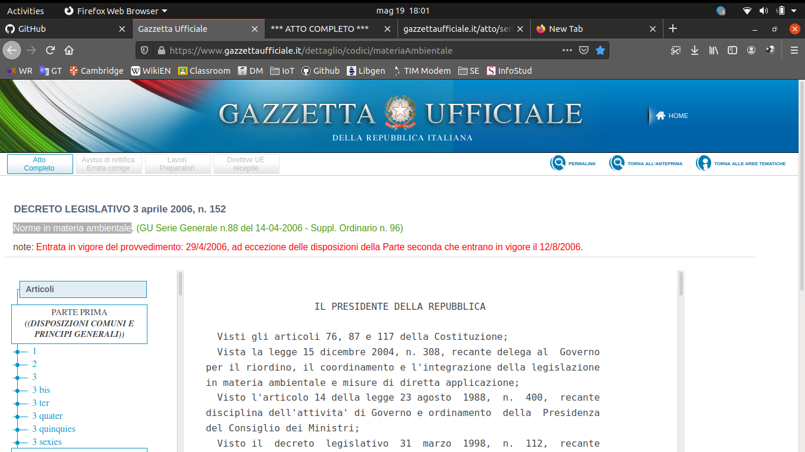
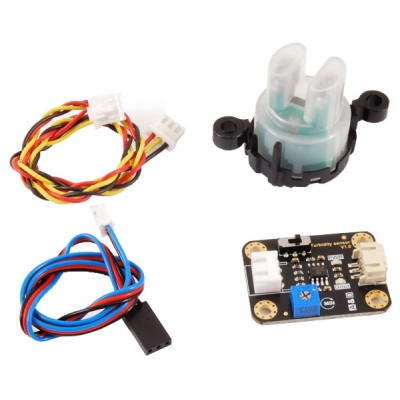
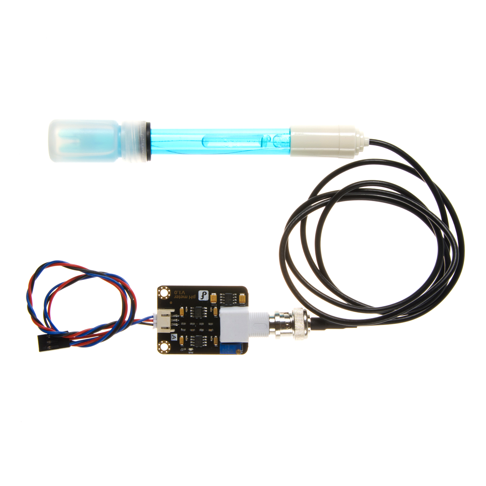
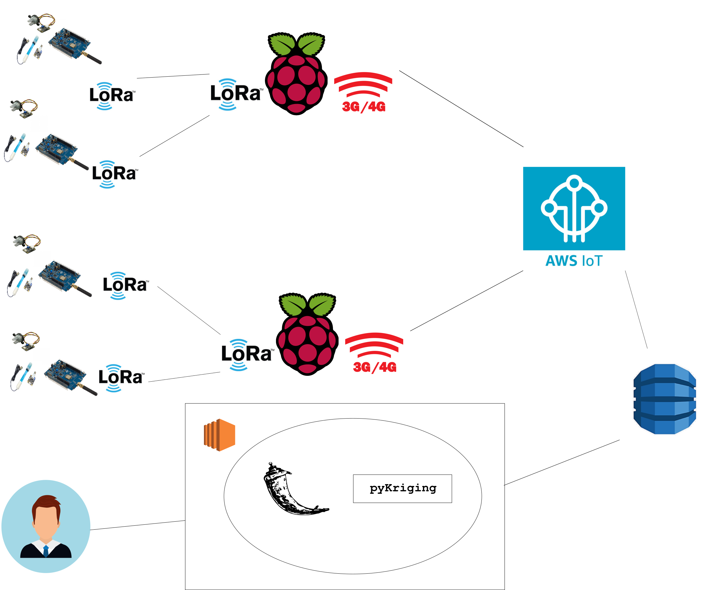

# HarbourWasteControl IoT 2021 - Technology
## Technical aspect and Assumption
In order to inspect and predict the quality of port waters, HarbourWasteControl takes into account two intrisic water parameters:
- [pH](https://en.wikipedia.org/wiki/PH), which is scale used to specify the acidity or basicity of an aqueous solution. Acidic solutions (solutions with higher concentrations of H+ ions) are measured to have lower pH values than basic or alkaline solutions. 
    - At 25 °C solutions with a pH less than 7 are **acidic**, 
    - At 25 °C solutions with a pH greater than 7 are **basic**
    - At 25 °C Solutions with a pH of 7 at this temperature are **neutral** (e.g. pure water).
    - A [pH meter](https://en.wikipedia.org/wiki/PH_meter) is a scientific instrument that measures the hydrogen-ion activity in water-based solutions, indicating its acidity or alkalinity expressed as pH.[2] The pH meter measures the difference in electrical potential between a pH electrode and a reference electrode
- [Turbidity](https://en.wikipedia.org/wiki/Turbidity), which is the cloudiness or haziness of a fluid caused by large numbers of individual particles that are generally invisible to the naked eye. The measurement of turbidity is a key test of water quality. Fluids can contain suspended solid matter consisting of particles of many different sizes. While some suspended material will be large enough and heavy enough to settle rapidly to the bottom of the container if a liquid sample is left to stand (the settable solids), very small particles will settle only very slowly or not at all if the sample is regularly agitated or the particles are colloidal.
    - [Turbidity sensor or Nephleometer](https://en.wikipedia.org/wiki/Nephelometer) is a scientific instrument for measuring the concentration of suspended particulates in a liquid or gas colloid. A nephelometer measures suspended particulates by employing a light beam (source beam) and a light detector set to one side (often 90°) of the source beam

**NOTE** We are perfectly aware that the physical quantities involved in this project, namely pH – temperature – Total Suspended Solids, are not enough to point out water pollution phenomenon inside a real harbour, since a complete analysis require a deeper study performed in a lab.

But according to the [Legislative decree 152/06](https://www.gazzettaufficiale.it/atto/serie_generale/caricaArticolo?art.progressivo=0&art.idArticolo=5&art.versione=1&art.codiceRedazionale=006G0171&art.dataPubblicazioneGazzetta=2006-04-14&art.idGruppo=54&art.idSottoArticolo1=10&art.idSottoArticolo=1&art.flagTipoArticolo=2), which regulates analysis of superficial waters, these parameters are among the fundamental one to be analyzed **immediately** at the sampling time and before the evaluation of water samples in laboratory, (regardless of context, type of environmental water) to 
So data provided by the sensor nodes spread all over the harbour, are the starting point for a more complex analysis and can reduce the workload of authorised personnel during sampling activity because these  don’t care about these parameters. In the end we use these sensors to build a model to predict the spread of water pollution inside the harbour. Give their importance they belong to “Parametri I gruppo”


##[High-level design & Components]
Implementation and Deploymnent of HWC follows design proposed during *Lecture 11 - Performance Evaluation for IoT* by [Prof. Andrea Vitaletti](https://github.com/andreavitaletti) and therefore involves two different places:
1. Real local node at our home
2. [FIT IoT-LAB Testbed](https://www.iot-lab.info)


The following sections describe in detail Hardware and Software deployed in each of the two workspaces above.

## 1. Real local node at our home
Real local node [ST B-L072Z-LRWAN1](https://www.st.com/en/evaluation-tools/b-l072z-lrwan1.html) ```st-lrwan1-local```, which directly makes use of LoRa modules and Turbidity and pH sensors 
* (Remotely) FIT IoT-LAB Testbed, which provide #25 [ST B-L072Z-LRWAN1](https://www.iot-lab.info/docs/boards/st-b-l072z-lrwan1/) ```st-lrwan1-1```-```st-lrwan1-25```, to perform large-scale evaluations
  * **NOTE** Because of the use of a remote testbed, it is not possible to connect intended sensors physically, pH sensor and Turbidity ones, in remote boards. There is no possibility to get real data from the sensors and so no pH alteration and Tubidity variations occurs (like conversely they happen in ```st-lrwan1-local```). 
  * To deal with this problem we have followed **Dataset traces** approach proposed throughout Lecture 11. In particular remote boards rely on [The Water Quality dataset](https://www.kaggle.com/adityakadiwal/water-potability) by Kaggle.com - Aditya Kadiwal. It is a CSV dataset containing water quality metrics for **3276 different water bodies**, in particular remote boards retrieve the two desired values from the dataset locally. In this way it possible to **simulate** behaviour of pH and Turbidity sensor with actual data as they were physically connected


 	http://www.usamahkhan.com/projects/spatial-interpolation
  
## Components
To the aim of HWC the following components are involved:
- The [B-L072Z-LRWAN1](https://www.st.com/en/evaluation-tools/b-l072z-lrwan1.html) is a development board to learn and develop solutions based on LoRa®, Sigfox™, and FSK/OOK technologies..
- The [Turbidity sensor SKU SEN0189](https://wiki.dfrobot.com/Turbidity_sensor_SKU__SEN0189) analyses water quality by measuring the levels of turbidity, or the opaqueness. It uses light to detect suspended particles in water by measuring the light transmittance and scattering rate, which changes with the amount of total suspended solids (TSS) in water. As the TTS increases, the liquid turbidity level increases. Turbidity sensors are used to measure water quality in rivers and streams, wastewater and effluent measurements, control instrumentation for settling ponds, sediment transport research and laboratory measurements. This liquid sensor provides analog and digital signal output modes. The threshold is adjustable when in digital signal mode. You can select the mode according to your MCU. 

- The [pH meter SKU SEN0161](https://wiki.dfrobot.com/PH_meter_SKU__SEN0161_) measure the pH, a scale used to specify the acidity or basicity of an aqueous solution. The pH of seawater is typically limited to a range between 7 and 8, and it plays an important role in the ocean's carbon cycle. The sensor works with a probe attached to the BNC connector, while the board must be connected using PH2.0 port. Its power consume doesn't exceed 10mA.


Component | Operating Voltage | Operating Current
------------ | -------------- | --------------
[LoRa module CMWX1ZZABZ-091](https://www.murata.com/en-eu/products/connectivitymodule/lpwa/overview/lineup/type-abz-078)  |        3.9V DC       | 128 mA (MAX)
[Turbidity sensor SKU SEN0189](https://wiki.dfrobot.com/Turbidity_sensor_SKU__SEN0189) |  5V DC         | 40 mA (MAX)
[pH meter SKU SEN0161](https://wiki.dfrobot.com/PH_meter_SKU__SEN0161_) |  5V DC         | 57 mA (MAX)

## Eletric circuit
https://bestengineeringprojects.com/arduino-ph-meter-using-ph-sensor/

## Architecture
When the sensor nodes are deployed their geographical location are hardcoded in their firmware. The sensor node is composed of a  **ST B-L072Z-LRWAN1**, one **pH sensor**, one **Turbidity sensor** SKU SEN0189. The board will run **RIOT OS** used to make it as easy as possible the coding of network functionalities and sensor drivers. The nodes read the data coming from the sensors and send it to a gateway. The gateway then will send the data to the cloud.

For the cloud-based backend services, we use AWS. The data received is strored in a **DynamoDB** table, it is fetched periodically and then analyzed by applying a method of interpolationan called **ùng**. The user has the possibility to view the result of the analysis analysis and the data collected from a dashboard. A **Flask** app running on an **AWS EC2** Instance will be responsible to run the analysis and the dashboard.

## Networking
The sensor node and the gateway comunicate via **LoRa**. The Lora gateway then sends the data to **TheThingsNewtork**, also known as TTN, then finally is sent to **AWS IoT**.

Lora classify end nodes in three differnet classes. The sensor nodes are considered Class A, battery powered sensor with no latency constraint, while the gateway is class C, because it can listen all the time for data.




#### Sources
1. https://wiki.dfrobot.com/Turbidity_sensor_SKU__SEN0189
2. https://wiki.dfrobot.com/PH_meter_SKU__SEN0161_
3. https://www.gazzettaufficiale.it/atto/serie_generale/caricaArticolo?art.progressivo=0&art.idArticolo=5&art.versione=1&art.codiceRedazionale=006G0171&art.dataPubblicazioneGazzetta=2006-04-14&art.idGruppo=54&art.idSottoArticolo1=10&art.idSottoArticolo=1&art.flagTipoArticolo=2
4. https://sensorex.com/ph-sensors-3/#comb-ph-tab
